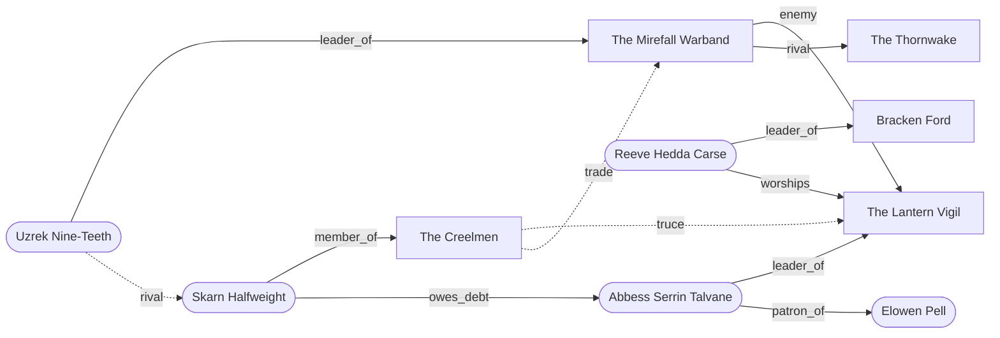

<!-- oa:generated begin section="map" -->

```mermaid
graph LR
  fac_mirefall_warband[The Mirefall Warband]
  fac_lantern_vigil[The Lantern Vigil]
  fac_creelmen[The Creelmen]
  fac_thornwake[The Thornwake]
  set_bracken_ford[Bracken Ford]
  npc_uzrek_nine_teeth([Uzrek Nine-Teeth])
  npc_hedda_carse([Reeve Hedda Carse])
  npc_serrin_talvane([Abbess Serrin Talvane])
  npc_skarn_halfweight([Skarn Halfweight])
  npc_elowen_pell([Elowen Pell])

  fac_mirefall_warband -- enemy --> fac_lantern_vigil
  fac_mirefall_warband -- rival --> fac_thornwake
  fac_creelmen -. truce .-> fac_lantern_vigil
  fac_creelmen -. trade .-> fac_mirefall_warband
  npc_uzrek_nine_teeth -- leader_of --> fac_mirefall_warband
  npc_uzrek_nine_teeth -. rival .-> npc_skarn_halfweight
  npc_hedda_carse -- leader_of --> set_bracken_ford
  npc_hedda_carse -- worships --> fac_lantern_vigil
  npc_serrin_talvane -- leader_of --> fac_lantern_vigil
  npc_serrin_talvane -- patron_of --> npc_elowen_pell
  npc_skarn_halfweight -- member_of --> fac_creelmen
  npc_skarn_halfweight -- owes_debt --> npc_serrin_talvane
```
<!-- oa:generated end -->
