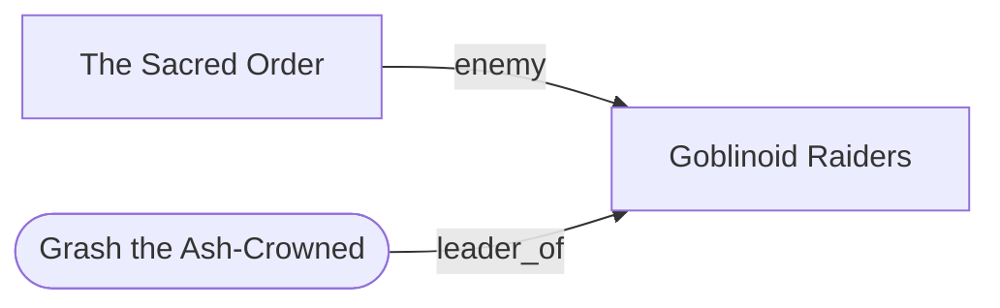

# Entity Model — NPCs, Factions, Relationships

**Spec version:** 0.2.0 · Part of the [Campaign Vault Specification](campaign-vault-spec.md).

This layer is **vault-owned**: no single app is the authority. Any app may mint
NPCs and factions into the shared folders; the GM edits them freely; every app
references them. This is deliberately additive — Dungeons on Automatic has
faction *assignment* (rooms, rosters, monster biasing) but no inter-faction
graph, so nothing here collides with existing app state.

## NPCs (`npcs/<slug>.md`, `oa_kind: npc`)

```markdown
---
title: Grash the Ash-Crowned
aliases: [Grash]
tags: [npc, role/boss, faction/goblinoid-raiders]
oa_id: npc_grash_ash_crowned
oa_kind: npc
oa_spec: 0.1.0
oa_generator: dungeons-on-automatic@0.1.71
oa_refs:
  home: site_k3f9x2
  location: site_k3f9x2#room_13
  factions: [fac_goblinoid_raiders]
identity:
  personal_name: Grash
  epithet: the Ash-Crowned
  quirk: collects the left boot of every delver slain
  motive: reclaim the deep forges for the warband
narrative_role: boss           # guard|hireling|rival_delver|lieutenant|boss|captive|merchant|guide|cultist|noncombat
stats:
  status: linked               # none|summary|linked
  source: dungeons-on-automatic
  cer: 62
  threat_tier: major           # minor|standard|major|severe
  sheet: sites/mirefall-warren/state/grash.gcs
relationships:
  - to: fac_goblinoid_raiders
    kind: leader_of
  - to: npc_vess_halfhand
    kind: rival
    strength: -2
    secret: true
    notes: Vess sold the warren's back entrance to the duke's scouts.
---

# Grash the Ash-Crowned

GM prose. Appearance, voice, table notes.

<!-- oa:generated begin section="identity" -->
Boss of the Mirefall Warren goblinoid raiders...
<!-- oa:generated end -->
```

Rules, carried over from DOA's NPC architecture:

- **Identity and stats stay separate.** `identity` (name/epithet/quirk/motive —
  DOA's `NamedOpponentIdentity` shape) is flavor and always safe to embed.
  `stats` is a pointer: `none` (pure narrative NPC), `summary` (cer/threat_tier
  cached inline), or `linked` (a sheet file, e.g. a `.gcs` export, referenced by
  vault-relative path). The stat authority is the app that generated the sheet;
  the vault stores the snapshot.
- `narrative_role` uses DOA's closed 10-value `NpcNarrativeRole` vocabulary.
- `threat_tier` uses the package vocabulary `minor|standard|major|severe`.
- Mook blocks are **not** NPCs. "3 × Orc Guard" stays inside its site's key as
  a count-based encounter. An NPC note means a *named individual* the campaign
  can reuse.
- Apps minting NPCs from generation should carry their deterministic ids into
  `oa_id` where practical (e.g. DOA's `named_grash_ash_crowned` becomes
  `npc_grash_ash_crowned`) and must record the origin app in `oa_generator`.

## Factions (`factions/<slug>.md`, `oa_kind: faction`)

```markdown
---
title: The Sacred Order
tags: [faction, faction/religious]
oa_id: fac_sacred_order
oa_kind: faction
oa_spec: 0.1.0
oa_refs:
  seat: set_a77c1p               # where it is headquartered (optional)
  presence: [reg_b8h2m4, site_k3f9x2]
faction:
  scope: regional                # site|local|regional|world
  origin: seed                   # seed|emergent|commissioned|gm
  theme_tags: [sacred, religious]
  source_faction_id: sacred_order   # the app-side FactionDef id, if any
relationships:
  - to: fac_goblinoid_raiders
    kind: enemy
    strength: -3
  - to: fac_thieves_guild
    kind: truce
    strength: 0
    secret: true
    notes: The abbot pays the guild to leave pilgrims alone.
---
```

Rules:

- **Embed resolved fields; don't trust foreign ids to resolve.** DOA's emergent
  factions are a pure function of each install's enabled source books — the
  same id can differ or not exist elsewhere. `source_faction_id` records the
  app-side id for provenance, but `title`, `theme_tags`, and the summary prose
  must stand alone.
- `origin` records **how the faction entered the vault**, and one faction
  keeps exactly one origin:
  - `seed` — copied from an app's static seed-faction catalog by the GM or the
    app directly;
  - `emergent` — derived by an app from the world/monster composition;
  - `commissioned` — supplied through a site/settlement commission (see
    [interop-contracts.md](interop-contracts.md));
  - `gm` — authored by hand.

  Provenance of the underlying app-side definition stays in
  `source_faction_id`, whatever the origin.
- A faction's *presence* list is how hexes, settlements, and sites say "this
  faction operates here" without those files having to enumerate members.
  Granularity: a **region-level** entry means diffuse presence across that
  region; **hex**, **settlement**, and **site** entries mean specific
  holdings. Entries are not additive duplicates — an app that knows the
  specific hexes/settlements/sites emits those refs and omits the region
  entry; an app that only knows "somewhere in this region" emits one region
  ref. Never both for the same presence.

## Relationships

Relationships are **edges declared in frontmatter** of NPC and faction notes
under the `relationships` key (un-prefixed — GMs are encouraged to author them).

```yaml
relationships:
  - to: fac_goblinoid_raiders    # oa_id, or compound ref
    kind: enemy                  # see vocabulary
    strength: -3                 # optional, -3..+3 (hostility..devotion)
    secret: true                 # optional; GM-only — stripped from player exports
    revealed: true               # optional (0.2.0); a disclosed secret keeps both flags
    since: era_2_sacred_order    # optional free-text or era id
    notes: one line of GM context
```

`revealed` follows the reveal model in the main spec: a `secret` edge exports
to players only once it also carries `revealed: true`; keeping both flags
preserves the history (the table knows *now*, and it was a secret *then*).
Edge `notes` never export either way. The compiled index carries `revealed`
through like `secret`.

### Kind vocabulary

Closed list, one edge each; direction reads `<file's entity> --kind--> to`:

| Kind | Directed? | Meaning |
| --- | --- | --- |
| `ally` | symmetric | Open cooperation |
| `enemy` | symmetric | Open hostility |
| `rival` | symmetric | Competition short of war |
| `truce` | symmetric | Suspended hostility |
| `trade` | symmetric | Commercial ties |
| `family` | symmetric | Blood or marriage ties |
| `member_of` | directed | NPC → faction membership |
| `leader_of` | directed | NPC → faction/settlement command |
| `patron_of` | directed | Sponsor → client |
| `vassal_of` | directed | Subordinate → liege |
| `owes_debt` | directed | Debtor → creditor |
| `worships` | directed | Follower → cult/faith faction |
| `spies_on` | directed | Watcher → target (almost always `secret`) |
| `custom` | either | Escape hatch; must add `label: <short phrase>` |

Rules:

- **Declare once.** Symmetric kinds are declared on either endpoint, not both.
  Directed kinds are declared on the *source* (an NPC's `member_of` lives on
  the NPC, not the faction). The compiled index materializes both directions.
- Conflicting duplicate edges (same pair, same kind, different fields) are a
  validation error; the fix is to keep one.
- Edges may target compound refs (`site_k3f9x2#room_13` for "haunts this
  room") but plain entity-to-entity edges are the norm.
- `secret: true` (or a `gm_note`-bearing edge) is GM-only and must be stripped
  from every player export.

### Derived artifacts

Two regenerable outputs are compiled from the declared edges (by apps or the
validator tool — any writer, same result):

1. **`_index/relationships.json`** — every edge as a record
   `{from, to, kind, strength?, secret?, label?, source_file}`; symmetric
   kinds are materialized in both directions, directed kinds keep their single
   declared direction. This is what apps consume; no app should re-parse
   frontmatter across the whole vault at runtime.
2. **`factions/relationship-map.md`** — a generated Mermaid graph for humans:

```markdown
---
title: Relationship Map
oa_id: fac_relationship_map
oa_kind: faction_map
oa_spec: 0.1.0
oa_audience: gm
---
<!-- oa:generated begin section="map" -->

<!-- oa:generated end -->
```

  Conventions: factions are rectangles, NPCs are stadium shapes
  (`([...])`), secret edges are rendered dashed (`-. kind .->`) and the map is
  GM-only; a player variant under `player/` omits undisclosed secret edges
  (`secret` without `revealed`) entirely.

## How the three apps use this layer

- **DOA** (site lens): on vault export, mints NPC notes for named opponents
  (bosses, lieutenants) and faction notes for the factions bound into the
  dungeon (`origin: seed|emergent|commissioned`), each with `oa_refs.home` /
  `location` pointing at the site and its rooms. It never writes inter-faction
  edges — those are GM/vault material — but its era `factionHint` and
  commission factions give the GM obvious edges to declare.
- **HOA** (region lens): reads faction `presence` to place lairs, patrols, and
  rumor sources on hexes; when it generates a region it may mint *stub*
  factions (`oa_status: stub`) for powers implied by the terrain (a border
  keep, a raider warband) that TOA/DOA/GM later flesh out.
- **TOA** (settlement lens): mints the civic cast — rulers, guilds, temples —
  as NPCs/factions, declares the *civic* edges it knows (`leader_of`,
  `member_of`, `trade`), and reads the relationship index to seed rumor tables
  and adventure hooks pointing at sites and hexes.
